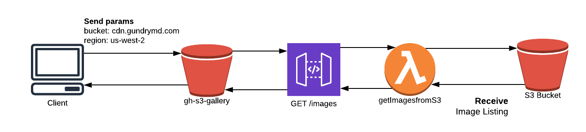

# Golden Hippo S3 Gallery
This project allows you to access the s3 images within our buckets and view them as a gallery.

The live URL is: https://gh-s3gallery.s3-us-west-2.amazonaws.com/index.html

## Configuration and Usage

Add the following parameters to the live URL to access the appropriate bucket:
(ie. https://gh-s3gallery.s3-us-west-2.amazonaws.com/index.html?bucket=cdn.gundrymd.com&region=us-west-2))

1. `bucket={bucketname}`
2. `region={AWS region bucket is located}`

## Available Scripts

In the project directory, you can run:

### `yarn start`

Runs the app in the development mode. 
Open [http://localhost:3000](http://localhost:3000) to view it in the browser.

The page will reload if you make edits. 
You will also see any lint errors in the console.

### `yarn build`

Builds the app for production to the `build` folder. 
It correctly bundles React in production mode and optimizes the build for the best performance.

The build is minified and the filenames include the hashes. 
Your app is ready to be deployed!

## Making changes
### Local
- Make sure that line 5 in page.js is set to `true`

### Uploading to S3
- Set line 5 in page.js to `false`
- `yarn build`
- Once complete, upload the `build` folder to the S3 bucket (gh-s3gallery) in AWS.